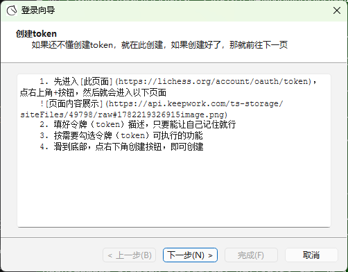
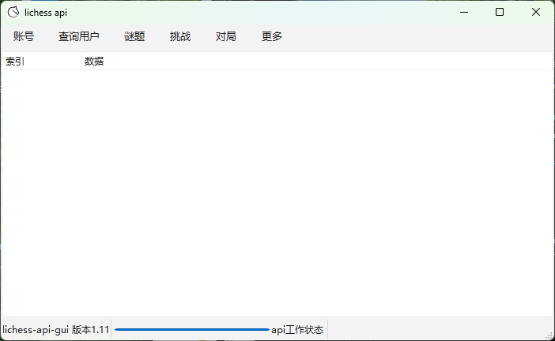

<h1>lichess-api-gui，版本2.0-ready</h1>
<a href="https://wyxx210704.github.io/lichess-api-gui/" target="_blank">点这里查看完整文档</a>

<h1>项目介绍</h1>
<ul>
    <li>本项目为wyxx210704原创项目，继承此项目请遵循MIT协议</li>
    <li>主要功能：为lichess api添加一个图形界面，方便控制</li>
</ul>

<h1>使用教程</h1>
<h2>一、为自己的账号添加API访问令牌（token）</h2>
<ol>
    <li>先填好令牌（token）描述，只要能让自己记住就行</li>
    <li>按需要勾选令牌（token）可执行的功能</li>
    <li>滑到底部，点右下角创建按钮，即可创建</li>
</ol>
<a href="https://lichess.org/account/oauth/token/create" target="_blank">点此按钮进入网站</a>

<h2>二、运行程序</h2>
<h3>python要求</h3>
<ul>
    <li><b>绝对不能</b>是python<b>3.14</b>，不然运行时候一登录，json就起冲突</li>
    <li>建议<b>python3.13</b>，不仅能保持最新，而且又不会出现依赖冲突</li>
    <li>
        必须有这几个库
         
        <ul>
            <li>PyQt6</li>
            <li>python-chess</li>
            <li>berserk</li>
        </ul>
    </li>
    <li>满足以上要求即可运行</li>
</ul>

<h3>运行方式</h3>

    windows双击该项目根目录的<code>run.bat</code>即可运行 
    macos/linux双击该项目根目录的<code>run.sh</code>即可运行 

    macos/linux用户在运行前需要<b>额外添加执行权限</b> 
    <code>chmod +x run.sh</code>

<h3>运行结果</h3>

    在运行过程中，每一个向API发送请求的操作都要等待两三秒，这两三秒内，<b>请不要动窗口</b>，不然就会搞未响应 
     
    首先会弹出一个登录窗口，然后就把前文提到的token输入进去，再点下面登录按钮就能登录 
     
    登录成功时会自动跳转到主窗口，登录失败就会放出报错的原因并且不会跳转，保留在这个对话框 
    以下是主窗口 
    

<ul>
    <li>菜单栏中是已经更新好的各个API请求</li>
    <li>请求返回的内容都会显示在下面这个树形组件里面</li>
</ul>